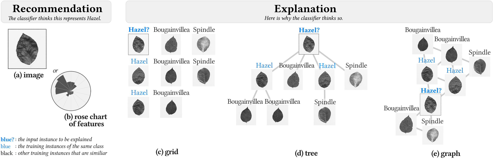

# How Do Visual Explanations Foster End Users' Appropriate Trust in Machine Learning?

_Proceedings of the ACM Conference on Intelligent User Interfaces (IUI), 2020_

**Authors**: Fumeng Yang, Zhuanyi (Yi) Huang, Jean Scholtz, and Dustin L. Arendt

**Abstract**:  We investigated the effects of example-based explanations for a machine learning classifier on end users' appropriate trust. 
    We explored the effects of spatial layout and visual representation in an in-person user study with 33 participants. 
    We measured participants' appropriate trust in the classifier, quantified the effects of different spatial layouts and visual representations, and observed changes in users' trust over time. 
    The results show that each explanation improved users' trust in the classifier, and the combination of explanation, human, and classification algorithm yielded much better decisions than the human and classification algorithm separately. 
    Yet these visual explanations lead to different levels of trust and may cause inappropriate trust if an explanation is difficult to understand. 
    Visual representation and performance feedback strongly affect users' trust, and spatial layout shows a moderate effect. 
    Our results do not support that individual differences (e.g., propensity to trust) affect users' trust in the classifier. 
    This work advances the state-of-the-art in trust-able machine learning and informs the design and appropriate use of automated systems.

## ML-Trust-paper.pdf
   - preprint of the paper
  
## supplmaterials
   - `altenative-representations.pdf` The alternative visual representations considered and evaluated in our study;
   - `appendices.pdf`
   - `examples.zip` The experimental stimuli we used;
   - `sub_experiment-images.mp4` and  `sub_experiment-roses.mp4` the videos to illustrate each sub experiment.

## ML-Trust-presentation.mp4 
A 19 minutes informal presentation for the paper.

## ML-Trust-slides.pdf
The slides for the above-mentioned presentation.

## trust-literature.md 
  Our literature review document.
    
## bibtex

@inproceedings{yang2020appropriatetrust,    
author = {Yang, Fumeng and Huang, Zhuanyi and Scholtz, Jean and Arendt, Dustin L.},   
title = {How Do Visual Explanations Foster End Users’ Appropriate Trust in Machine Learning?},   
year = {2020},    
isbn = {9781450371186},   
publisher = {Association for Computing Machinery},   
address = {New York, NY, USA},   
url = {https://doi.org/10.1145/3377325.3377480 },    
doi = {10.1145/3377325.3377480},      
booktitle = {Proceedings of the 25th International Conference on Intelligent User Interfaces},  
pages = {189–201},   
numpages = {13},   
location = {Cagliari, Italy},   
series = {IUI ’20}  
}
